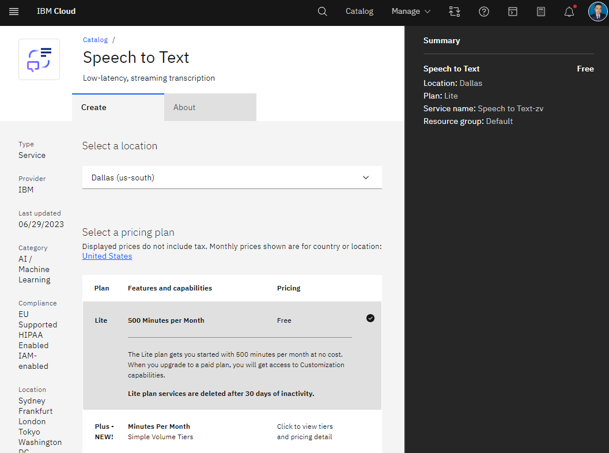
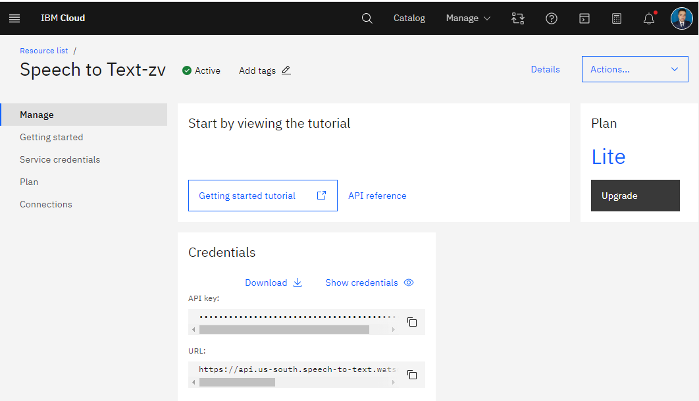

# Creating a Virtual Webcam Chatbot That Responds to Voice Commands in a Video Meeting

## Introduction:

In this tutorial, we'll walk you through the process of creating a virtual webcam chatbot that responds to voice commands in a video meeting. The chatbot will listen for a specific activation word, transcribe audio, send the text to the AI, and display the chatbot's response on the virtual webcam video feed.

We'll use technologies like OpenAI's GPT-3 for generating chatbot responses, IBM Watson Speech to Text for converting audio to text, IBM Watson Text to Speech for converting text to audio, and PyVirtualCam for streaming the audio as output through a virtual webcam. So let's get started!

## Step 1: Setting up the Environment

First we are going to install our enviroment with python 3.10.11 here , after you installed in your working directory you can create your enviroment

```
python -m venv .venv

```

You’ll notice a new directory in your current working directory with the same name as your virtual environment, then activate the virtual environment.


```
.venv\Scripts\activate.bat

```
usually is convinent having the latest pip
python -m pip install --upgrade pip
optionally  we can install Jupyter Notebook
```
pip install ipykernel notebook

```
then we install our kernel name

```
python -m ipykernel install --user --name watson --display-name "Python (watson)"

```
Before we begin, let's set up the environment by installing the necessary libraries. Open your terminal or command prompt and run the following commands:

```
pip install pyaudio openai ibm_watson opencv-python  pyvirtualcam  langchain ibm-watson-machine-learning python-dotenv
```
## Step 2 : API keys 

### IBM Cloud
1. Log in to your IBM Cloud account or sign up for a new account if you don't have one.
2. Go to the IBM Cloud Catalog: https://cloud.ibm.com/catalog/
3. Search for "Speech to Text" and click on the "Speech to Text" service.
 

4. On the service page, choose a region, plan (Lite or Standard), and give your service a name and tags if you want. Then click the "Create" button.
   

5. Once the service is created, you'll be taken to the "Manage" tab of your new Speech to Text service instance. Here you can find your API key and the service endpoint URL. Make sure to save this information somewhere secure, as you'll need it to access the API.

Repeat the same process for the Text-to-Speech service. In step 3, search for "Text to Speech" and follow the same steps. You'll get a separate API key and endpoint URL for this service.

Now you have the API keys and endpoints for both Watson Speech-to-Text and Text-to-Speech services. You can use these to make API requests from your application.


```
### Open AI

To get an API key from OpenAI, you'll need to sign up for an account and access the API key from the OpenAI Dashboard. Here's a step-by-step guide:
1. Go to the OpenAI website: https://www.openai.com/
2. Click on the "Get started" or "Sign up" button to create a new account. If you already have an account, click on "Log in" to sign in to your account.
3. After signing up or logging in, you'll be redirected to the OpenAI Dashboard.
4. On the Dashboard, click on the "API Keys" tab in the sidebar menu.
5. You should see a list of your API keys. If you don't have any API keys, click on the "Create API Key" button.
6. Fill in the required information for the new API key, such as a name and a description. Select the appropriate permissions for the key, then click "Create".
7. Once the API key is created, you'll see the key in the API Keys list. Copy the API key to use it in your application. Remember to keep the key secure, as it provides access to the OpenAI API with your account's permissions.


To add an API key in a .env file , first, create a .env file in your project directory and add the API key like this:

```
IBM_SPEECH_TO_TEXT_API=your_api_key_here
IBM_TEXT_TO_SPEECH_API=your_api_key_here
CHATGPT_API_KEY=your_api_key_here
```

## Step 2: Capturing Audio
We'll start by capturing audio in real-time using the PyAudio library. 
Create a new Python file (e.g., `audio_capture.py`) and add the following code:

```python
import pyaudio
import wave
import threading
import queue

# Audio settings
FORMAT = pyaudio.paInt16
CHANNELS = 1
RATE = 44100
CHUNK = 1024
RECORD_SECONDS = 5

# Create audio stream queue
audio_queue = queue.Queue()

# Create a flag to indicate when to trigger ChatGPT
trigger_chatgpt = False

# Function to capture audio and add it to the queue
def capture_audio():
    p = pyaudio.PyAudio()

    stream = p.open(format=FORMAT,
                    channels=CHANNELS,
                    rate=RATE,
                    input=True,
                    frames_per_buffer=CHUNK)

    print("Capturing audio...")

    while True:
        frames = []
        for i in range(0, int(RATE / CHUNK * RECORD_SECONDS)):
            data = stream.read(CHUNK)
            frames.append(data)
        audio_queue.put(b''.join(frames))

        # Check if the word "computer" is said
        if b'computer' in b''.join(frames):
            trigger_chatgpt = True

    stream.stop_stream()
    stream.close()
    p.terminate()

# Start capturing audio in a separate thread
audio_thread = threading.Thread(target=capture_audio)
audio_thread.start()
```

Step 3: Converting Audio to Text
Using IBM Watson Speech to Text, we'll convert the captured audio into text. Add the following code to `audio_capture.py`:

```python
from ibm_watson import SpeechToTextV1
from ibm_cloud_sdk_core.authenticators import IAMAuthenticator
from dotenv import load_dotenv
load_dotenv()
# IBM Watson Speech to Text settings
IBM_SPEECH_TO_TEXT_API = os.getenv('IBM_SPEECH_TO_TEXT_API')

URL = 'https://api.us-south.speech-to-text.watson.cloud.ibm.com/instances/your_instance_id'

# Function to convert audio to text
def convert_audio_to_text(audio_data):
    authenticator = IAMAuthenticator(API_KEY)
    speech_to_text = SpeechToTextV1(authenticator=authenticator)
    speech_to_text.set_service_url(URL)

    response = speech_to_text.recognize(audio=audio_data,
                                        content_type='audio/l16; rate=44100',
                                        model='en-US_BroadbandModel',
                                        continuous=True,
                                        ).get_result()

    return response['results'][0]['alternatives'][0]['transcript']
```

Step 4: Generating Chatbot Responses
To generate chatbot responses, we'll use OpenAI's GPT-3. Create a new Python file (e.g., `chatbot.py`) and add the following code:

```python
import openai

# OpenAI GPT-3 settings
OPENAI_API_KEY = 'your_openai_api_key'

# Function to generate answer using ChatGPT
def generate_answer(question):
    openai.api_key = OPENAI_API_KEY

    response = openai.Completion.create(
        engine='text-davinci-003',
        prompt=question,
        max_tokens=100,
        temperature=0.7,
        n=1,
        stop=None,
        timeout=15
    )

    answer = response.choices[0].text.strip()
    return answer
```

Step 5: Converting Text to Speech
Using IBM Watson Text to Speech, we'll convert the generated chatbot response from text to audio. Add the following code to `chatbot.py`:

```python
from ibm_watson import TextToSpeechV1
from ibm_cloud_sdk_core.authenticators import IAMAuthenticator

# IBM Watson Text to Speech settings
API_KEY = 'your_api_key'
URL = 'https://api.us-south.text-to-speech.watson.cloud.ibm.com/instances/your_instance_id'

# Function to convert text to speech
def convert_text_to_speech(text, output_file):
    authenticator = IAMAuthenticator(API_KEY)
    text_to_speech = TextToSpeechV1(authenticator=authenticator)
    text_to_speech.set_service_url(URL)

    with open(output_file, 'wb') as audio_file:
        response = text_to_speech.synthesize(
            text,
            accept='audio/mp3',
            voice='en-US_AllisonV3Voice'
        ).get_result()

        audio_file.write(response.content)
```

Step 6: Streaming Audio as Webcam Output
We'll use PyVirtualCam to stream the generated audio as the output of a virtual webcam. Add the following code to `chatbot.py`:

```python
import cv2
import numpy as np
import pyvirtualcam

# Webcam settings
WIDTH = 640
HEIGHT = 480

# Start virtual webcam
with pyvirtualcam.Camera(width=WIDTH, height=HEIGHT, fps=30) as cam:
    print(f'Using virtual camera: {cam.device_name}')

    # Continuously monitor audio and generate chatbot answers
    while True:
        if not audio_queue.empty() and trigger_chatgpt:
            audio_data = audio_queue.get()
            text = convert_audio_to_text(audio_data)

            # Trigger ChatGPT and generate answer
            question = " ".join(text.split("computer")[1:])
            answer = generate_answer(question)

            # Convert answer to speech and play it
            output_file = 'answer.mp3'
            convert_text_to_speech(answer, output_file)
            playsound(output_file)

            # Read the generated audio
            audio = pyaudio.PyAudio()
            wf = wave.open(output_file, 'rb')

            # Stream the audio frames as webcam output
            while True:
                data = wf.readframes(CHUNK)
                if len(data) == 0:
                    break
                cam.send(data)
                cam.sleep_until_next_frame()

            wf.close()
            audio.terminate()

        # Sleep for a short duration to avoid high CPU usage
        time.sleep(0.1)
```

Running the Program:
To run the program, follow these steps:

1. Make sure you have all the required libraries installed.
2. Replace the placeholder API keys with your own API keys for IBM Watson Speech to Text and Text to Speech services, as well as your OpenAI API key.
3. Adjust the desired settings like audio capture duration, webcam resolution, etc., according to your requirements.
4. Save the code in the respective Python files as mentioned above (`audio_capture.py` and `chatbot.py`).
5. Execute the Python files in separate terminal windows using the command `python audio_capture.py` and `python chatbot.py`.
6. When the program starts running, it will capture audio and initiate the chatbot response when the trigger word is detected.
7. The chatbot's response will be converted to speech and displayed on the virtual webcam video feed.
8. You can use the virtual webcam as the video input source in your video conferencing application, and the chatbot's responses will be visible alongside the video feed.

Conclusion:
In this blog post, we have learned how to create a virtual webcam chatbot that responds to voice commands in a video meeting. By utilizing OpenAI's GPT-3, IBM Watson Speech to Text, and IBM Watson Text to Speech, we can convert audio to text, generate chatbot responses, and stream the responses as audio through a virtual webcam. With this setup, we can enhance video conferencing experiences by adding an interactive chatbot component. Feel free to customize the code and experiment further with different models and services to create your own unique virtual webcam chatbot!

Full Code:
You can find the full code for this project on our GitHub repository: [https://github.com/yourusername/virtual-webcam-chatbot](https://github.com/yourusername/virtual-webcam-chatbot)

Note: Remember to handle the use of APIs in accordance with their terms of service and usage limits.